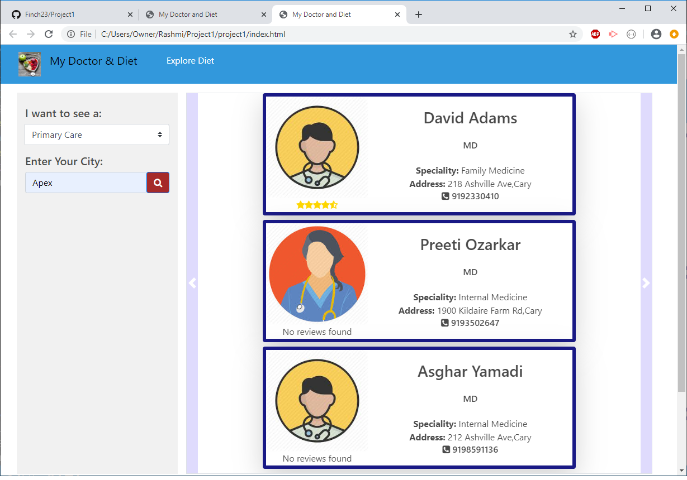
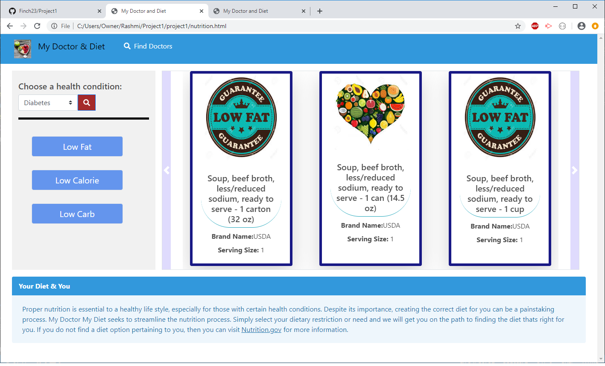

# Repository:
- Every patient is unique and each patient's treatment and diet plan should reflect that individuality.

## User Story:		My Doctor & Diet
    -		As a patient
	-   	I want to explore doctors, their details also I can explore healthy food options for my condition
	-   	so that I can plan my visit to a doctor and takecare of my diet.
## Installation:
This project uses HTML5 and following specifications:
- CSS Frameworks: Bootstrap and Bulma.
- Code editor: VScode. 
- Version controller: Git.
- Project Management tool: Kanban.
- JS library: Jquery
## Usage:
- 'My Doctor and Diet' application comes handy for users to find doctors in their area, plus depending on user health condition it can suggest the diet plans he/she should follow. This app will run in the browser and feature dynamically updated HTML and CSS powered by your JavaScript(Jquery) code.The user will be prompted to select mainly: 
	### Find Doctor:
    - **Type of Doctor**: User can select the type of doctor like 'primary care' or 'specialist'.
    - **City**: The city where user is searching for the doctor.
    ### Explore Diet:
    - **Condition of the user**: User can select the body codition he/she is suffering from then the app provides the suggestions for diet accordingly.
    
## Deployed link:
	https://finch23.github.io/Project1/
### Find Doctor's page:

### Explore Diet's page:

## Credits:
UNC Chapelhill

## License
Copyright (c). All rights reserved. 